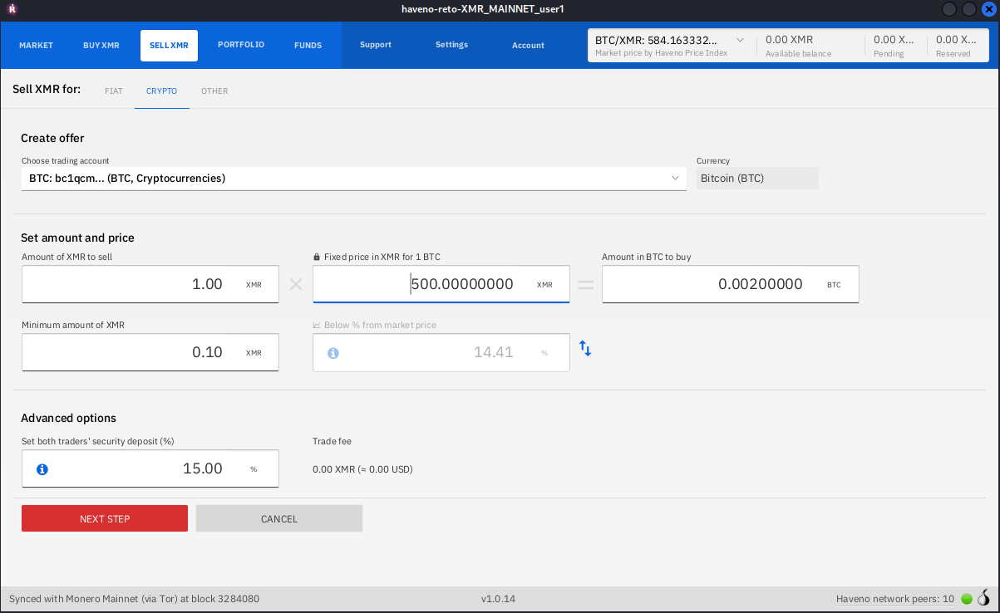
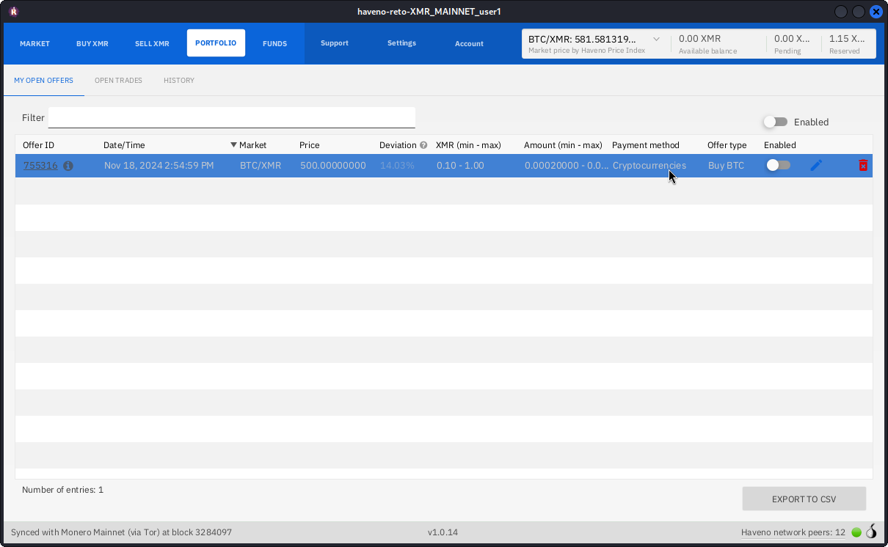
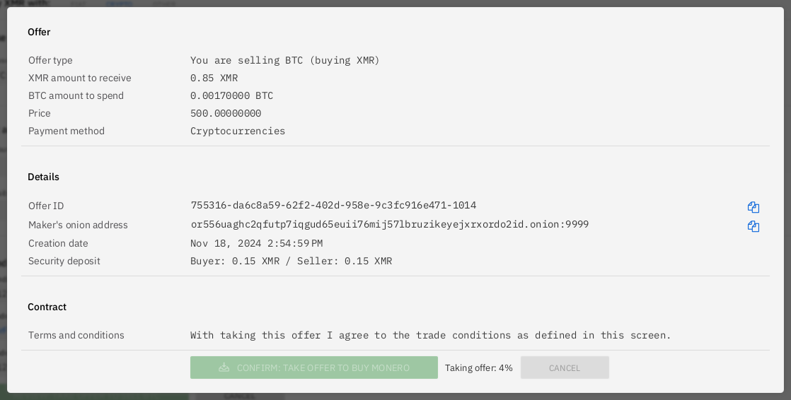
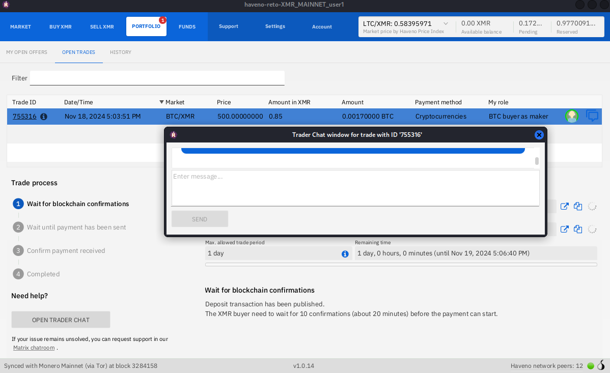
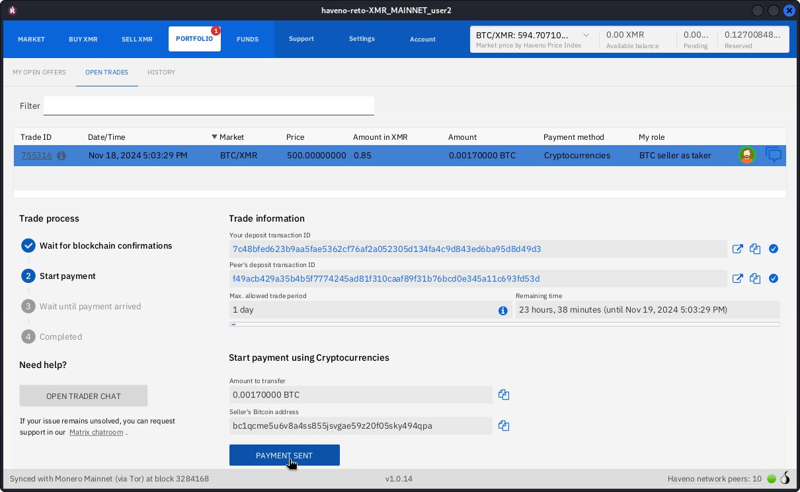
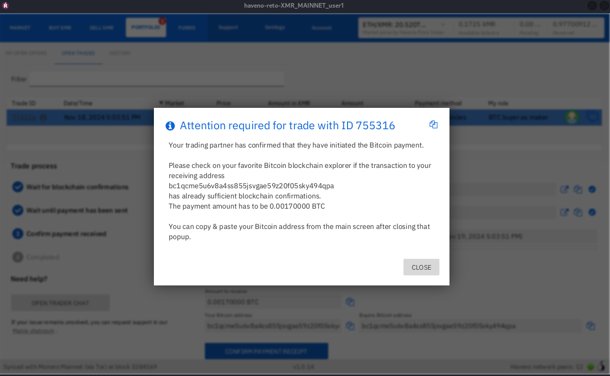

## Get started on Haveno-reto

### 1. Launching Haveno

/// caption
Nothing to do expect launching the app and waiting for all services initalized
///

/// caption
Once all services are ready, the market will be shown.
///

### 2. Backup your seed and setup a trading account

Go in `Account` and click on `Seed` tab to backup your main wallet.

You also can set a wallet password for additionnal security

Trading needs an account for the payment method and currency used to take and publish offers, it also ensure data integrity and protects against evil actors trying to use stolen accounts.

### 3. Trading

### 3.1 Create, fund and publish your offer (maker)

Go in the market you want to trade (in our example selling Monero for Bitcoin) and click on `CREATE OFFER TO SELL XMR`

You can set an optional minimum of XMR to buy, if you want flexible sizes to be accessible and setting a fixed price or a % derivation (below or above the market price) before clicking on `NEXT STEP`.

After the offer is set, you need to fund your trade offer with a security deposit worth 15% of the trade (as shown earlier) before placing your offer.
In our case since we sell we technically need 115% of the trade.

It is generally advised to externally fund your trade so you'll need to wait for block confirmations, balance is shown as **pending** until the external deposit reached 10 block confirmations and you will have the possibility to click on `REVIEW: PLACE OFFER TO BUY BTC` when funds will be shown in **available balance**.

Confirm placing your offer, you can take your TradeID to share it privately to someone or reviewing the summary before confirming.

Now the offer is published, you can disable it if you wont be available or for activating it to people you know only.

### 3.2 Find and take an offer (taker)

As a taker, go in the market you want and take an offer.

Or filter TradeIDs / peer hidden-service to take specific offers.

Set a custom amount if the maker allows or if you need it, click on next step.

Fund your trade with a 15% security deposit and click on next step.

Confirm taking the offer and it will initiate the trade.

### 3.3 Trading steps

Once the trade is setup, go in `MY OPEN OFFERS` and click on your trade. To get the trading chat for contacting your peer, click on the chat icon.

/// caption
Peers need to wait 10 confirmations before trading (chain re-org protection)
///

In our example the taker buy XMR so marking `PAYMENT SENT` once BTC funds are sent to the maker.

The seller (maker in our case) receive the payment notification.

The maker clicks on confirm receiving the payment after having verified it.

After the payment has been confirmed as received, both peers can close the trade and funds will be paid-out to their main wallets.

